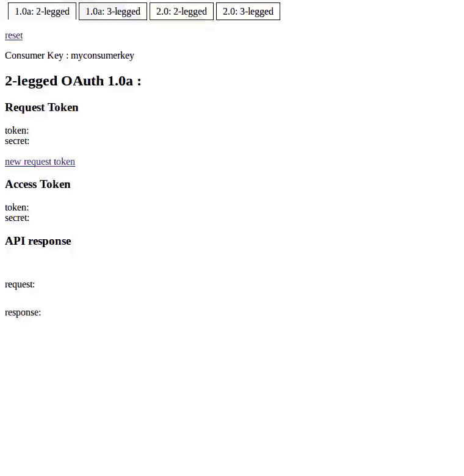

# oauth-php-lib

This library was implemented from official documentations to understand the protocol as a whole.

It is mostly intended for pedagogical and learning use.



## Examples

Run composer install to get dependencies and autoload :

``` 
composer install
``` 

Set up your web server to have 3 websites on 3 distinct hosts :
 - Your OAuth 1.0 server : examples/oauth1.0-server/
 - Your OAuth 2.0 server : examples/oauth2.0-server/
 - Your test client      : examples/client/

In the examples/client/index.php file, replace oauth(1.0|2.0).local host by your actual server hosts created previously.

For testing purposes, this exemples are using session as data store which should never be used in production !<br />
You can change the files in examples/src/ and create your own server and data store relying on a database.

## Server

To set up a server, just create a subclass of OAuth1ApiServer or OAuth2ApiServer depending on the version you plan to use.

You will have to implement the Data Store on your own database to get a working server.

```php
<?php

/**
 * OAuth 2.0 Server example 
 */

use DevSeb\OAuthPhpLib\OAuth\OAuthAccessToken;
use DevSeb\OAuthPhpLib\OAuth\OAuthConsumer;
use DevSeb\OAuthPhpLib\OAuth\OAuthRefreshToken;
use DevSeb\OAuthPhpLib\OAuth\OAuthRequestToken;
use DevSeb\OAuthPhpLib\OAuth\OAuthToken;
use DevSeb\OAuthPhpLib\Server\OAuth2ApiServer;
use DevSeb\OAuthPhpLib\Client\HttpRequest;

class MyOAuth2ApiServer extends OAuth2ApiServer
{
    public function __construct(HttpRequest $Request)
    {
        parent::__construct($Request);
    }
        
    //================================================================================================
    // OAuth2ApiServer implementation
    
    // TODO: implement Data Store

    protected function isNonceUsed(OAuthConsumer $Consumer, OAuthToken $Token, $nonce, $timestamp){}
    protected function getConsumer($consumerKey){}
    protected function getConsumerFromToken($tokenKey){}
    protected function getToken(OAuthConsumer $Consumer, $tokenKey, $tokenType){}
    protected function newRequestToken(OAuthConsumer $Consumer, $redirectUri = ''){}
    protected function newAccessToken(OAuthConsumer $Consumer, OAuthRequestToken $RequestToken = null, OAuthRefreshToken $RefreshToken = null){}
    protected function showLoginPage(){}
    protected function authenticateUser(OAuthConsumer $Consumer, $username, $password){}      
    
}
?>
``` 

## Client

The client library can be used with any OAuth server.  In the below example, replace the upper case dummy values :

```php
<?php

/**
 * 3-legged OAuth 2.0 Client example
 */

use DevSeb\OAuthPhpLib\Client\OAuth2ApiClient;
use DevSeb\OAuthPhpLib\OAuth\OAuthRequest;
use DevSeb\OAuthPhpLib\OAuth\OAuthAccessToken;
use DevSeb\OAuthPhpLib\OAuth\OAuthRequestToken;
use DevSeb\OAuthPhpLib\OAuth\OAuthConsumer;

$Consumer = new OAuthConsumer('API_CONSUMER_KEY', 'API_CONSUMER_SECRET');

$Client = new OAuth2ApiClient('API_URL', $Consumer);

// Authenticate user
$Client->authenticate('AUTHENTICATION_CALLBACK_URL', 'scope', 'state');

// => redirect to authentication page
// ... authenticate 
// <= redirect to callback URL with code

// Get RequestToken
$requestToken = $_GET['code'];

// Get AccessToken and RefreshToken from RequestToken
$RequestToken = new OAuthRequestToken($requestToken);
list($AccessToken, $RefreshToken) = $Client->getAccessTokenFromAuthorizationCode($RequestToken);

// Call API using AccessToken
$Request = new OAuthRequest('API_URL');
$Response = $Client->getOAuthResponse($Request, $AccessToken);
var_dump($Response->getBody());

?>
```  

## Documentation

The PHP API is documented in doc/index.html

The basic description of the different flows depending on OAuth version and usage are as follow :

### OAuth 1.0a

Official documentation : https://oauth.net/core/1.0a/

1-legged OAuth 1.0a :

``` 
  Consumer                          Server
       1. Request access token
     |-------------------------------->|
       2. Issue an access token
     |<--------------------------------|
       3. Call protected API
     |-------------------------------->|
       4. Send response
     |<--------------------------------|
```     
 
2-legged OAuth 1.0a :
 
``` 
  Consumer                          Server
       1. Request a token
     |-------------------------------->|
       2. Issue a request token
     |<--------------------------------|
       3. Request access token
     |-------------------------------->|
       4. Issue an access token
     |<--------------------------------|
       5. Call protected API
     |-------------------------------->|
       6. Send response
     |<--------------------------------|
```
 
3-legged OAuth 1.0a :
 
``` 
   Browser                 Consumer                    Server
                                 1. Request a token
                               |------------------------->|
                                 2. Issue a request token
                               |<-------------------------|
     3. Redirect to auth page
   |<--------------------------|
                  4. Grant access to consumer
   |----------------------------------------------------->|
                  5. Confirm user authorization
   |<-----------------------------------------------------|
     6. Redirect to callback
   |-------------------------->|
                                 7. Request access token
                               |------------------------->|
                                 8. Issue an access token
                               |<-------------------------|
                                 9. Call protected API
                               |------------------------->|
                                 10. Send response
                               |<-------------------------|
```                               

### OAuth 2.0

Official documentation : https://oauth.net/2/

2-legged OAuth 2.0 :
 
``` 
  Consumer                          Server
       1. Request access token
     |-------------------------------->|
       2. Issue an access token
     |<--------------------------------|
       3. Call protected API
     |-------------------------------->|
       4. Send response
     |<--------------------------------|
```      
 
3-legged OAuth 2.0 :
 
```  
   Browser                 Consumer                    Server
      1. Redirect to auth page
   |<--------------------------|
                  2. Grant access to customer
   |----------------------------------------------------->|
                  3. Confirm user authorization
   |<-----------------------------------------------------|
     4. Redirect to callback
   |-------------------------->|
                                 5. Request access token
                               |------------------------->|
                                 6. Issue an access token
                               |<-------------------------|
                                 7. Call protected API
                               |------------------------->|
                                 8. Send response
                               |<-------------------------|
```              